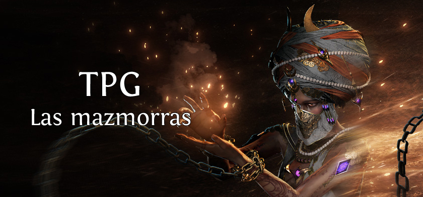

[](https://classroom.github.com/a/JYHpxpbv)
# TPG - 1c2026 - Las Mazmorras

<p align="center">
   <br>
</p>

## Integrantes:

1. Leonel Ezequiel Gonzalez

## Entregables:

1. [Informe de complejidad algorítmica](https://drive.google.com/file/d/1bHbfyPOCWtuQZzFM_nMFA0fjiOGvJjb5/view?usp=sharing)

## Configuración del proyecto

El proyecto está configurado usando [Maven](https://maven.apache.org/),
y puede ser compilado, empaquetado y probado fácilmente usando los siguientes comandos:

### Compilar

```
mvn compile
```

### Empaquetar

```
mvn package
```

### Pruebas

```
mvn test
```

## Aclaraciones para el corrector

Si necesitan aclarar o justificar alguna decisión de implementación,
lo pueden hacer escribiendo en esta sección del README.

---

## Licencia y Propiedad Intelectual

Todo el código producido por los estudiantes debe ser de código abierto bajo la **Licencia MIT**.

**Aviso Legal:** Este proyecto es un trabajo práctico educativo, **no comercial**. Todos los recursos visuales (sprites,
iconos, nombres de items) son propiedad intelectual de **Grinding Gear Games** y se utilizan en este repositorio
únicamente con fines educativos y de aprendizaje sobre estructuras de datos y algoritmos.
